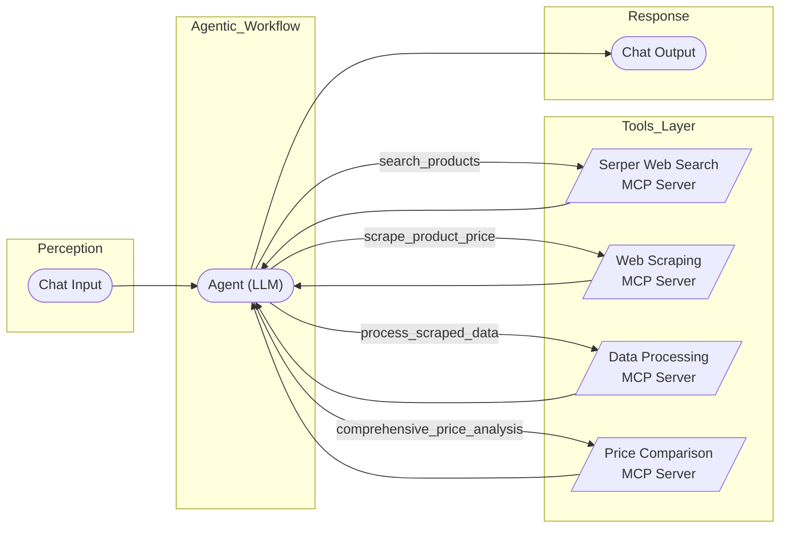

# Implementing the Price Comparison Agent in Langflow

This document provides corrected guidance on how to implement the Price Comparison Agent, as depicted in the architecture diagram, within Langflow. This implementation demonstrates an **agentic workflow** where the LLM orchestrates multiple external Model Context Protocol (MCP) servers through standardized communications to achieve a complex goal.

## Understanding the Agentic Workflow and MCP

Before implementing, it's important to understand that:

1. **The entire system is an agentic workflow** where the Agent (LLM) perceives user input, plans actions, executes tools, and produces responses
2. **MCP is the communication protocol** that enables standardized interaction between the LLM and external tools
3. **Each specialized capability is provided by an MCP server** that exposes specific functions

As clarified in the MCP documentation, Langflow acts as an MCP client and connects to external MCP servers using the `MCP Tools` component. This means:

1. **Create separate MCP servers** (as Python scripts) that expose the required tools
2. **Use the `MCP Tools` component** in Langflow to connect to these external servers
3. **Connect the `MCP Tools` components** to an `Agent` component that orchestrates their use through the MCP protocol

## Updated Architecture Overview



The enhanced price comparison agent now includes **four specialized MCP servers** that work together to provide comprehensive product search and price comparison capabilities:

1. **Serper Web Search MCP Server** - Discovers product URLs using Google Search API
2. **Web Scraping MCP Server** - Extracts prices from discovered product pages
3. **Data Processing MCP Server** - Standardizes and validates scraped data
4. **Price Comparison MCP Server** - Analyzes prices and provides recommendations

This creates a sophisticated pipeline: **Search → Scrape → Process → Compare**

## Step 1: Create External MCP Servers (The Communication Infrastructure)

Before building your Langflow flow, you need to create the external MCP servers that will provide the specialized capabilities for your price comparison agent. Remember that MCP is the **communication infrastructure** that enables the LLM to interact with external tools. Based on our enhanced architecture, you need four separate MCP servers:

### 1.1 Serper Web Search MCP Server

Create a file named `serper_web_search_mcp_server.py`:

```python
import requests
import json
import sys
import time
import os
from mcp.server.fastmcp import FastMCP
from typing import Dict, List, Optional, Any
from dataclasses import dataclass
from urllib.parse import urlparse

# Try to load environment variables from .env file
try:
    from dotenv import load_dotenv
    load_dotenv()
    print("Loaded environment variables from .env file", file=sys.stderr)
except ImportError:
    print("python-dotenv not installed, using system environment variables only", file=sys.stderr)
except Exception as e:
    print(f"Error loading .env file: {e}", file=sys.stderr)

@dataclass
class SearchResult:
    """Represents a search result from Serper API."""
    title: str
    url: str
    snippet: str
    domain: str
    position: int
    price: Optional[str] = None
    rating: Optional[float] = None
    review_count: Optional[int] = None

class SerperWebSearchAnalyzer:
    """
    SerperWebSearchAnalyzer provides intelligent product search using Serper API.

    This server discovers product URLs across e-commerce sites and provides
    targeted search results for price comparison workflows.
    """

    def __init__(self):
        self.mcp = FastMCP("serper_web_search_analyzer")
        print("Serper Web Search MCP Server initialized", file=sys.stderr)

        # Serper API configuration - read from environment variables
        self.api_key = os.getenv('SERPER_APIKEY') or os.getenv('SERPER_API_KEY')
        if not self.api_key:
            print("ERROR: SERPER_APIKEY or SERPER_API_KEY environment variable not found!", file=sys.stderr)
            print("Please set your Serper API key in the .env file or environment", file=sys.stderr)
            sys.exit(1)

        self.base_url = "https://google.serper.dev/search"
        self.headers = {
            'X-API-KEY': self.api_key,
            'Content-Type': 'application/json'
        }

        # Common e-commerce domains for filtering
        self.ecommerce_domains = {
            'amazon.com', 'ebay.com', 'walmart.com', 'target.com',
            'bestbuy.com', 'newegg.com', 'etsy.com', 'shopify.com',
            'alibaba.com', 'aliexpress.com', 'costco.com', 'homedepot.com',
            'lowes.com', 'wayfair.com', 'overstock.com', 'zappos.com'
        }

        self._register_tools()

    def _register_tools(self):
        @self.mcp.tool()
        async def search_products(product_name: str, max_results: int = 10, include_price_sites_only: bool = True) -> dict:
            """
            Searches for products using Serper API and returns e-commerce results.

            Returns URLs and product information for price comparison.
            """
            print(f"Searching for product: {product_name}", file=sys.stderr)

            # Enhanced search query for better product results
            enhanced_query = f"{product_name} price buy shop"

            # Make API request to Serper
            payload = json.dumps({
                "q": enhanced_query,
                "num": max_results,
                "gl": "us"
            })

            try:
                response = requests.post(self.base_url, headers=self.headers, data=payload, timeout=30)
                response.raise_for_status()
                api_response = response.json()

                # Process and filter results
                results_data = []
                for result in api_response.get('organic', []):
                    domain = self._extract_domain(result.get('link', ''))
                    if include_price_sites_only:
                        if not any(ecom_domain in domain for ecom_domain in self.ecommerce_domains):
                            continue

                    result_dict = {
                        "title": result.get('title', ''),
                        "url": result.get('link', ''),
                        "domain": domain,
                        "snippet": result.get('snippet', ''),
                        "position": result.get('position', 0)
                    }

                    # Extract price if mentioned in snippet
                    snippet = result.get('snippet', '')
                    if '$' in snippet:
                        import re
                        price_match = re.search(r'\$[\d,]+\.?\d*', snippet)
                        if price_match:
                            result_dict["price_mentioned"] = price_match.group()

                    results_data.append(result_dict)

                print(f"Found {len(results_data)} relevant results for {product_name}", file=sys.stderr)

                return {
                    "product_name": product_name,
                    "success": True,
                    "total_results": len(results_data),
                    "ecommerce_filtered": include_price_sites_only,
                    "results": results_data
                }

            except Exception as e:
                print(f"Serper API request failed: {e}", file=sys.stderr)
                return {
                    "product_name": product_name,
                    "success": False,
                    "error": f"Search failed: {str(e)}",
                    "results": []
                }

        @self.mcp.tool()
        async def get_product_urls_for_comparison(product_name: str, target_sites: Optional[List[str]] = None) -> dict:
            """
            Gets product URLs specifically for price comparison from major e-commerce sites.

            Returns organized URLs by site for systematic price comparison.
            """
            print(f"Getting comparison URLs for: {product_name}", file=sys.stderr)

            if not target_sites:
                target_sites = ["amazon.com", "walmart.com", "target.com", "bestbuy.com", "ebay.com"]

            # Search for product on specific sites
            search_query = f"{product_name} site:({' OR site:'.join(target_sites)})"

            payload = json.dumps({
                "q": search_query,
                "num": 20,
                "gl": "us"
            })

            try:
                response = requests.post(self.base_url, headers=self.headers, data=payload, timeout=30)
                response.raise_for_status()
                api_response = response.json()

                # Organize results by site
                urls_by_site = {site: [] for site in target_sites}

                for result in api_response.get('organic', []):
                    url = result.get('link', '')
                    domain = self._extract_domain(url)

                    for site in target_sites:
                        if site in domain:
                            urls_by_site[site].append({
                                "url": url,
                                "title": result.get('title', ''),
                                "snippet": result.get('snippet', ''),
                                "price_mentioned": self._extract_price_from_snippet(result.get('snippet', ''))
                            })
                            break

                # Remove empty sites
                urls_by_site = {site: urls for site, urls in urls_by_site.items() if urls}

                total_urls = sum(len(urls) for urls in urls_by_site.values())
                print(f"Found {total_urls} URLs across {len(urls_by_site)} sites", file=sys.stderr)

                return {
                    "product_name": product_name,
                    "target_sites": target_sites,
                    "success": True,
                    "total_urls_found": total_urls,
                    "sites_with_results": len(urls_by_site),
                    "urls_by_site": urls_by_site
                }

            except Exception as e:
                print(f"Error in URL search: {e}", file=sys.stderr)
                return {
                    "product_name": product_name,
                    "success": False,
                    "error": str(e),
                    "urls_by_site": {}
                }

    def _extract_domain(self, url: str) -> str:
        """Extracts domain name from URL."""
        try:
            parsed = urlparse(url)
            domain = parsed.netloc.lower()
            return domain.replace('www.', '')
        except Exception:
            return 'unknown'

    def _extract_price_from_snippet(self, snippet: str) -> Optional[str]:
        """Extracts price from search result snippet."""
        if '$' in snippet:
            import re
            price_match = re.search(r'\$[\d,]+\.?\d*', snippet)
            if price_match:
                return price_match.group()
        return None

    def run(self):
        try:
            print("Starting Serper Web Search MCP Server...", file=sys.stderr)
            self.mcp.run(transport="stdio")
        except Exception as e:
            print(f"Fatal Error in Serper Web Search MCP Server: {str(e)}", file=sys.stderr)
            sys.exit(1)

if __name__ == "__main__":
    analyzer = SerperWebSearchAnalyzer()
    analyzer.run()
```

**Setup Requirements:**

- Install required packages: `pip install requests python-dotenv`
- Get a Serper API key from [serper.dev](https://serper.dev)
- Set environment variable: `SERPER_APIKEY=your_api_key_here`

### 1.2 Web Scraping MCP Server

Create a file named `web_scraping_mcp_server.py`:

```python
import sys
import json
import requests
from bs4 import BeautifulSoup
from mcp.server.fastmcp import FastMCP

class WebScrapingAnalyzer:
    def __init__(self):
        self.mcp = FastMCP("web_scraping_analyzer")
        print("Web Scraping MCP Server initialized", file=sys.stderr)
        self._register_tools()

    def _register_tools(self):
        @self.mcp.tool()
        async def scrape_product_price(product_name: str, website_urls: list) -> dict:
            """Scrapes the price of a product from multiple websites."""
            print(f"Scraping {product_name} from {len(website_urls)} websites", file=sys.stderr)
            results = []

            for url in website_urls:
                try:
                    # This is a simplified example. Real web scraping would be more complex.
                    print(f"Attempting to scrape {url}", file=sys.stderr)

                    # For demonstration, return mock data
                    # In a real implementation, you would use requests and BeautifulSoup
                    mock_price = f"${(hash(url) % 500 + 100):.2f}"  # Generate a mock price

                    results.append({
                        "product": product_name,
                        "website": url,
                        "price": mock_price,
                        "success": True
                    })
                except Exception as e:
                    results.append({
                        "product": product_name,
                        "website": url,
                        "error": str(e),
                        "success": False
                    })

            print(f"Scraped {len(results)} results", file=sys.stderr)
            return {"results": results}

    def run(self):
        try:
            print("Running Web Scraping MCP Server...", file=sys.stderr)
            self.mcp.run(transport="stdio")
        except Exception as e:
            print(f"Fatal Error in MCP Server: {str(e)}", file=sys.stderr)
            sys.exit(1)

if __name__ == "__main__":
    analyzer = WebScrapingAnalyzer()
    analyzer.run()
```

### 1.3 Data Processing MCP Server

Create a file named `data_processing_mcp_server.py`:

```python
import sys
import json
import re
from mcp.server.fastmcp import FastMCP

class DataProcessingAnalyzer:
    def __init__(self):
        self.mcp = FastMCP("data_processing_analyzer")
        print("Data Processing MCP Server initialized", file=sys.stderr)
        self._register_tools()

    def _register_tools(self):
        @self.mcp.tool()
        async def process_scraped_data(raw_data: dict) -> dict:
            """Processes raw scraped product data into a standardized format."""
            print("Processing scraped data", file=sys.stderr)
            processed_results = []

            for item in raw_data.get("results", []):
                if item.get("success"):
                    try:
                        # Extract numeric price from string
                        price_str = item.get("price", "0")
                        price_match = re.search(r'[\d,]+\.?\d*', price_str.replace("$", "").replace(",", ""))
                        price = float(price_match.group()) if price_match else 0.0

                        processed_results.append({
                            "product": item.get("product"),
                            "website": item.get("website"),
                            "price": price,
                            "original_price_string": price_str
                        })
                    except (ValueError, AttributeError) as e:
                        print(f"Could not process price: {item.get('price')} - {e}", file=sys.stderr)
                        continue

            print(f"Processed {len(processed_results)} valid results", file=sys.stderr)
            return {"processed_data": processed_results}

    def run(self):
        try:
            print("Running Data Processing MCP Server...", file=sys.stderr)
            self.mcp.run(transport="stdio")
        except Exception as e:
            print(f"Fatal Error in MCP Server: {str(e)}", file=sys.stderr)
            sys.exit(1)

if __name__ == "__main__":
    analyzer = DataProcessingAnalyzer()
    analyzer.run()
```

### 1.4 Price Comparison MCP Server

Create a file named `price_comparison_mcp_server.py`:

```python
import sys
import json
from mcp.server.fastmcp import FastMCP

class PriceComparisonAnalyzer:
    def __init__(self):
        self.mcp = FastMCP("price_comparison_analyzer")
        print("Price Comparison MCP Server initialized", file=sys.stderr)
        self._register_tools()

    def _register_tools(self):
        @self.mcp.tool()
        async def find_lowest_price(processed_data: dict) -> dict:
            """Finds the lowest price from processed product data."""
            print("Finding lowest price", file=sys.stderr)

            data_list = processed_data.get("processed_data", [])
            if not data_list:
                return {
                    "lowest_price": "N/A",
                    "source": "N/A",
                    "message": "No valid data to compare.",
                    "all_prices": []
                }

            lowest_item = None
            all_prices = []

            for item in data_list:
                price = item.get("price", 0)
                all_prices.append({
                    "website": item.get("website"),
                    "price": price,
                    "original_price_string": item.get("original_price_string")
                })

                if lowest_item is None or price < lowest_item["price"]:
                    lowest_item = item

            if lowest_item:
                result = {
                    "lowest_price": lowest_item["price"],
                    "source": lowest_item["website"],
                    "product": lowest_item["product"],
                    "message": "Lowest price found successfully.",
                    "all_prices": all_prices
                }
                print(f"Lowest price: ${lowest_item['price']:.2f} from {lowest_item['website']}", file=sys.stderr)
                return result
            else:
                return {
                    "lowest_price": "N/A",
                    "source": "N/A",
                    "message": "Could not determine lowest price.",
                    "all_prices": all_prices
                }

    def run(self):
        try:
            print("Running Price Comparison MCP Server...", file=sys.stderr)
            self.mcp.run(transport="stdio")
        except Exception as e:
            print(f"Fatal Error in MCP Server: {str(e)}", file=sys.stderr)
            sys.exit(1)

if __name__ == "__main__":
    analyzer = PriceComparisonAnalyzer()
    analyzer.run()
```

## Step 2: Building the Agentic Workflow in Langflow

Now that you have your external MCP servers (the specialized tools), you can build the agentic workflow in Langflow that will orchestrate these tools:

### 2.1 Add Core Agentic Workflow Components

1.  **Start a New Project**: Create a new project in Langflow (e.g., "Price Comparison Agentic Workflow").
2.  **Add `Chat Input` and `Chat Output`**: Place these on the canvas for perception (input) and response (output).
3.  **Add `Agent` Component**: This will be the "brain" of the agentic workflow, responsible for planning, reasoning, and orchestrating the tools.

### 2.2 Add and Configure `MCP Tools` Components (The Tool Communication Layer)

You need to add four separate `MCP Tools` components, one for each external MCP server. These components form the communication infrastructure of your agentic workflow, enabling the LLM to discover and interact with external tools through the standardized MCP protocol:

#### 2.2.1 Serper Web Search MCP Tools Component

1. Drag and drop an `MCP Tools` component onto the canvas.
2. Rename it to "Serper Web Search Tools" for clarity.
3. Double-click to configure:
   - Click **"Add MCP Server"**.
   - Select **STDIO** mode.
   - **Name**: `SerperWebSearchServer`
   - **Command**: `python /absolute/path/to/your/serper_web_search_mcp_server.py`
   - Click **"Add Server"**.
4. In the **Tool** field, select `search_products` or `get_product_urls_for_comparison` (or leave blank for all tools).
5. Enable **Tool Mode** in the component's header menu.

#### 2.2.2 Web Scraping MCP Tools Component

1.  Drag and drop an `MCP Tools` component onto the canvas.
2.  Rename it to "Web Scraping Tools" for clarity.
3.  Double-click to configure:
    - Click **"Add MCP Server"**.
    - Select **STDIO** mode.
    - **Name**: `WebScrapingServer`
    - **Command**: `python /absolute/path/to/your/web_scraping_mcp_server.py`
    - Click **"Add Server"**.
4.  In the **Tool** field, select `scrape_product_price` (or leave blank for all tools).
5.  Enable **Tool Mode** in the component's header menu.

#### 2.2.3 Data Processing MCP Tools Component

1. Add another `MCP Tools` component.
2. Rename it to "Data Processing Tools".
3. Configure:
   - **Name**: `DataProcessingServer`
   - **Command**: `python /absolute/path/to/your/data_processing_mcp_server.py`
   - **Tool**: `process_scraped_data`
4. Enable **Tool Mode**.

#### 2.2.4 Price Comparison MCP Tools Component

1. Add a fourth `MCP Tools` component.
2. Rename it to "Price Comparison Tools".
3. Configure:
   - **Name**: `PriceComparisonServer`
   - **Command**: `python /absolute/path/to/your/price_comparison_mcp_server.py`
   - **Tool**: `comprehensive_price_analysis`
4. Enable **Tool Mode**.

### 2.3 Configure the Agent (The "Brain" of Your Agentic Workflow)

1. Configure the `Agent` component, which acts as the central orchestrator of your agentic workflow:

   - **Model Provider**: Select your LLM provider (e.g., `OpenAI`).
   - **Model Name**: Choose a suitable model (e.g., `gpt-4-turbo`).
   - **API Key**: Provide your API key.
   - **Agent Instructions**: Provide clear instructions for orchestrating the enhanced workflow:

     ```text
     You are an intelligent price comparison assistant coordinating an enhanced agentic workflow. When a user asks for product price comparisons:

     1. PLANNING: Analyze the user's request to understand the product they want to compare
     2. DISCOVERY: Use search_products from Serper Web Search to find relevant product URLs across e-commerce sites
     3. EXTRACTION: Use scrape_product_price from Web Scraping to gather actual price data from discovered URLs
     4. PROCESSING: Use process_scraped_data from Data Processing to clean and standardize the results
     5. ANALYSIS: Use comprehensive_price_analysis from Price Comparison to identify the best deals and generate insights
     6. SYNTHESIS: Present a comprehensive answer including:
        - The lowest price and where to find it
        - Complete price comparison across all sources
        - Potential savings and value recommendations
        - Site-specific insights and trends
        - Direct links to the best deals

     Remember that you are orchestrating these specialized tools via the MCP protocol. Each tool handles a specific part of the enhanced workflow: Search → Scrape → Process → Compare.

     If a user provides specific website URLs, you can skip the search step and proceed directly to scraping.
     ```

### 2.4 Connect the Enhanced Agentic Workflow Components

1. Connect the **Toolset** outputs of all four `MCP Tools` components to the **Tools** input of the `Agent` component. This makes all MCP tools accessible to the Agent.
2. Connect `Chat Input` to the `Input` of the `Agent` component (perception phase of the workflow).
3. Connect the `Response` output of the `Agent` component to the `Chat Output` (action/response phase).

This connectivity represents the complete enhanced agentic workflow, where:

- The user input enters the system via Chat Input (perception)
- The Agent processes the input and plans necessary actions (reasoning/planning)
- The Agent orchestrates the MCP tools in the optimal sequence: Search → Scrape → Process → Compare (action execution via MCP)
- The Agent synthesizes a comprehensive response based on all tool outputs (synthesis)
- The result is delivered to the user via Chat Output (response)

## Step 3: Testing Your Enhanced Agentic Price Comparison Workflow

1. Open the Langflow **Playground**.
2. Enter a query like: "Find the lowest price for a DJI Mavic Pro 4 across different websites."
3. Watch as the enhanced agentic workflow executes:
   - **Perception**: The system receives your query about the DJI Mavic Pro 4
   - **Planning**: The Agent (LLM) determines it needs to follow the enhanced workflow
   - **Action Execution** (via MCP protocol):
     - The Agent calls the Serper web search MCP tool to discover relevant product URLs
     - The Agent then calls the web scraping MCP tool to extract price data from discovered URLs
     - The Agent calls the data processing MCP tool to standardize and validate the results
     - Finally, the Agent calls the price comparison MCP tool to perform comprehensive analysis
   - **Response Synthesis**: The Agent creates a detailed answer based on all tool results
   - **Output**: The system presents a comprehensive comparison with lowest prices, savings potential, site recommendations, and direct purchase links

## Enhanced Workflow Integration

The updated price comparison agent supports multiple usage patterns:

### Pattern 1: Autonomous Product Discovery

**User Input**: "Find the best price for iPhone 15 Pro Max"
**Workflow**: Search → Scrape → Process → Compare
**Agent Actions**:

1. Uses Serper to find iPhone product pages across e-commerce sites
2. Scrapes prices from discovered URLs
3. Processes and standardizes price data
4. Provides comprehensive comparison with recommendations

### Pattern 2: Targeted Site Comparison

**User Input**: "Compare iPhone 15 Pro Max prices on Amazon, Best Buy, and Walmart"
**Workflow**: Targeted Search → Scrape → Process → Compare
**Agent Actions**:

1. Uses Serper with site-specific queries
2. Scrapes from specified retailers only
3. Processes data with focus on requested sites
4. Provides side-by-side comparison

### Pattern 3: Direct URL Analysis

**User Input**: "Compare prices for these URLs: [list of product URLs]"
**Workflow**: Scrape → Process → Compare (skips search)
**Agent Actions**:

1. Directly scrapes provided URLs
2. Processes extracted data
3. Provides detailed price analysis

## Enhanced Workflow Benefits

The integration of Serper Web Search provides several key advantages:

### Automated Product Discovery

- **No Manual URL Collection**: Users don't need to provide specific product URLs
- **Comprehensive Coverage**: Automatically searches across major e-commerce platforms
- **Real-time Results**: Finds current product listings and availability

### Intelligent Search Optimization

- **E-commerce Focus**: Filters results to prioritize shopping sites
- **Price-aware Queries**: Enhances search terms to find price-relevant pages
- **Site-specific Targeting**: Can target specific retailers based on user preferences

### Scalable Comparison

- **Dynamic Site Discovery**: Finds products on new or lesser-known e-commerce sites
- **Broad Market Coverage**: Not limited to pre-configured websites
- **Contextual Results**: Returns search results with price mentions and product details

## Implementation Best Practices

Based on MCP agent best practices and the enhanced architecture:

### Technical Implementation Notes

- **Absolute Paths**: Use absolute paths to your MCP server Python files in the **Command** fields.
- **Dependencies**: Ensure that `fastmcp`, `requests`, `python-dotenv`, and other required libraries are installed in the Python environment where Langflow is running.
- **API Keys**: Set up your Serper API key in environment variables (`SERPER_APIKEY`) for the web search functionality.
- **Error Handling**: Monitor the Langflow logs and the stderr output from your MCP servers for debugging.
- **Rate Limiting**: The Serper and web scraping servers include rate limiting to respect API limits and website policies.
- **Mock Data**: The web scraping server can use mock data for demonstration. In production, implement actual web scraping with proper error handling and robots.txt compliance.

### Enhanced MCP Tool Design Principles

- **Single Responsibility**: Each MCP server focuses on one specific task (search, scraping, processing, or comparison)
- **Sequential Composability**: Tools are designed to work together in the enhanced pipeline: Search → Scrape → Process → Compare
- **Data Flow Optimization**: Each tool outputs data in formats optimized for the next tool in the sequence
- **Idempotent Operations**: Same input produces the same output for reliability
- **Graceful Degradation**: Each server includes error handling for graceful failure recovery

### Agent Orchestration Guidelines

- **Intelligent Tool Selection**: The agent can adaptively choose between direct URL scraping or search-first workflows
- **Context Management**: Ensure the agent maintains context across the extended tool chain
- **Performance Optimization**: Be mindful of tool execution times, especially for search and scraping operations
- **Fallback Strategies**: Define what the agent should do if any tool in the pipeline fails
- **User Experience**: Provide progress indicators for longer operations involving multiple web requests

### Advanced Extensions (Optional)

- **Parallel Processing**: Modify web scraping to process multiple URLs concurrently
- **Cache Integration**: Add caching layers to avoid redundant searches and scraping
- **Price History**: Extend data processing to track price changes over time
- **Multi-region Support**: Use Serper's location parameters for region-specific price comparison
- **Alert Systems**: Add notification capabilities for price drop alerts
- **Comparison Refinement**: Allow users to specify preferred retailers or price ranges

This enhanced implementation leverages both intelligent search discovery and targeted web scraping to create a more autonomous and comprehensive price comparison agent.

## References

[1] Langflow Documentation: Use Langflow as an MCP client. Available at: [https://docs.langflow.org/mcp-client](https://docs.langflow.org/mcp-client)
[2] Model Context Protocol Specification: [https://modelcontextprotocol.io/](https://modelcontextprotocol.io/)
[3] MCP Server Examples: [https://github.com/modelcontextprotocol](https://github.com/modelcontextprotocol)
